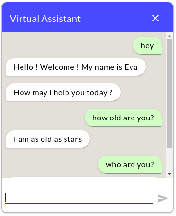

# eva-bot

EVA (Enterprise Virtual Assistant) Web Chat Component made with [Rasa](https://www.rasa.com)



Made using Polymer's [lit-element](https://lit-element.polymer-project.org/)

## Install

#### Unpkg

```
<script type="module" src="https://unpkg.com/@navigateconsulting/web-channel@latest/build/default/eva-bot.js"></script>

```

#### NPM

```
npm install @navigateconsulting/web-channel --save

```

#### Usage

```
<!doctype html>
<html lang="en">
  <head>
    <script type="module" src="https://unpkg.com/@navigateconsulting/web-channel@latest/build/default/eva-bot.js"></script>
  </head>
  <body>
    <eva-bot />
  </body>
</html>
```

#### Configurable Variables

Below are the Configurable variables for the web component:

```
headerText {type: String, default_value: Virtual Assistant}

headerButtonColor {type: String, default_value: #007BFF}

serverUrl {type: String, default_value: http://localhost:5005/webhooks/rest/webhook (Rasa Endpoint)}
```

#### License

[Apache-2.0](https://github.com/navigateconsulting/virtual-assistant/blob/master/LICENSE)
